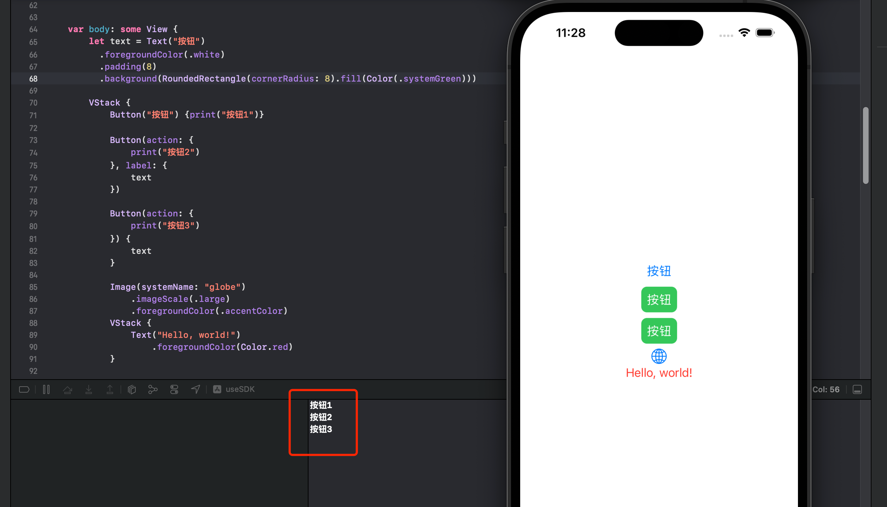

# string uint8 base64 相互转换
string转其他
```swift
var str = "abcd123!"

str.bytes // [97, 98, 99, 100, 49, 50, 51, 33]

str.bytes.toBase64() // "YWJjZDEyMyE="
str.data(using: .utf8)?.base64EncodedString()   // "YWJjZDEyMyE="
```

uint8转其他
```swift
var uint8: Array<UInt8> = [97, 98, 99, 100, 49, 50, 51, 33]

String(bytes: uint8, encoding: .utf8) // "abcd123!"
String(decoding: uint8, as: UTF8.self) // "abcd123!"    Update for Swift 5.2.2

uint8.toBase64() // "YWJjZDEyMyE="
```

base64转其他
```swift
var base64 = "YWJjZDEyMyE="

let data = Data(base64Encoded: base64)!
String(data: data, encoding: .utf8)  // "abcd123!"  如果不是utf8格式转出的结果会是nil

data.bytes  // [97, 98, 99, 100, 49, 50, 51, 33]
String(data: data, encoding: .utf8)?.bytes  // [97, 98, 99, 100, 49, 50, 51, 33]

```


## 扩展string添加base64的方法

```swift
extension String {
    func base64Encoded() -> String? {
        data(using: .utf8)?.base64EncodedString()
    }

    func base64Decoded() -> String? {
        guard let data = Data(base64Encoded: self) else { return nil }
        return String(data: data, encoding: .utf8)
    }
}
```

现在可以这样使用base64了
```swift
let string = "Let's encode this string"
let encoded = string.base64Encoded()
let decoded = encoded?.base64Decoded()
```


# iOS给Button添加点击事件的三种方法

```swift
var body: some View {
    let text = Text("按钮")
     .foregroundColor(.white)
     .padding(8)
     .background(RoundedRectangle(cornerRadius: 8).fill(Color(.systemGreen)))
     
    VStack {
      Button("按钮") {print("按钮1")}
       
      Button(action: {
        print("按钮2")
      }, label: {
        text
      })
       
      Button(action: {
        print("按钮3")
      }) {
        text
      }
       
    }
    .padding()
  }
```




