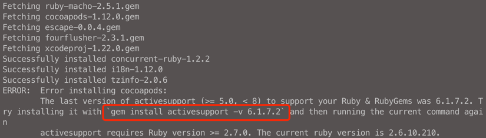
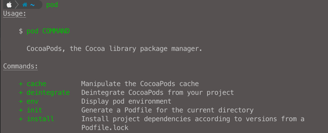

# CocoaPods
CocoaPods 是一个管理xcode第三方依赖库的工具

## 安装和使用cocoapods
RubyGems is a sophisticated package manager for Ruby
```shell
sudo gem install cocoapods
```

如果安装失败根据提示重新操作  


安装成功就可以使用pod了  



进入到项目根目录  
首次安装可以执行`pod init`, 执行完成会生成一个Podfile文件

编辑Podfile文件, 输入要安装的库和版本信息
```pod
# Uncomment the next line to define a global platform for your project
# platform :ios, '9.0'

target 'MyApp' do
  # Comment the next line if you don't want to use dynamic frameworks
  use_frameworks!

  # Pods for MyApp
  pod 'CryptoSwift', '~> 1.6.0'
  pod 'AFNetworking', '~> 2.6'
  pod 'ORStackView', '~> 3.0'
  pod 'SwiftyJSON', '~> 2.3'
end
```

安装
```shell
pod install
```

使用

CocoaPods在安装后会修改我们的Xcode工程，生成一个工作空间，这个工作空间由Project工程和Pods工程组成，我们所依赖的仓库就位于这个Pods工程中，所以安装完毕后提示要通过xxxx.xcworkspace文件来打开整个工程。


[CocoaPods文档](https://guides.cocoapods.org/)

